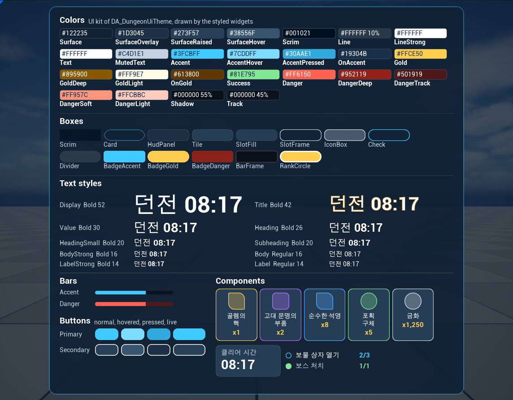

# UI style of the testbed samples

Frozen on 2026-09-15, when the user approved the kit gallery. The values are those of the theme
`Content/Samples/DungeonUi/Data/DA_DungeonUiTheme`, whose class defaults in `Source/AgentMcpTestbed/AgentMcpSampleUiTheme.cpp` hold the
same values; `WBP_UiKitGallery` shows all of them, and the captures in `Art/Style/baseline/` are the approved look.
[Docs/UiStyleSystem.md](../../Docs/UiStyleSystem.md) describes the system.

To change the style, change the theme, capture the gallery and the screens that use the change, and compare them with the baseline
(`capture_compare.py` of the `ui-style-system` skill). Replace the baseline and this file only when the user approves the change.



## Direction

A fantasy ruin lit by cyan arcane light, over the game scene. Dark, slightly transparent navy panels with thin lines; cyan for the accent,
progress and primary actions; gold only for rank, currency, rewards and bonuses; red only for danger and the boss; white text with
muted labels. Panels stay calm, and decoration marks structure.

The style frame `Art/Style/style_frame_dungeon_result.png` sets the mood. The approved look keeps the shapes of the existing screens
instead of copying the frame.

## Colors

sRGB as drawn; the theme stores the linear values. A style may lower a token's opacity further, as noted.

| Token | sRGB | Opacity | Use |
|---|---|---|---|
| `Surface` | #122235 | 100% | Popup card, at 96% |
| `SurfaceOverlay` | #1D3045 | 100% | HUD panels, at 82%; pressed secondary button |
| `SurfaceRaised` | #273F57 | 100% | Tiles and reward slots, at 95%; secondary button |
| `SurfaceHover` | #38556F | 100% | Hovered secondary button |
| `Scrim` | #001021 | 100% | Backdrop behind popups, at 66% |
| `Line` | #FFFFFF | 10% | Outlines of HUD panels and tiles, dividers |
| `LineStrong` | #FFFFFF | 100% | Outline of secondary buttons |
| `Text` | #FFFFFF | 100% | Titles, values and body text |
| `MutedText` | #C4D1E1 | 100% | Labels and subtitles; reward slot frames and icon boxes until the rarity color applies |
| `Accent` | #3FCBFF | 100% | Primary button, progress and experience, open objectives, floor badge; popup card outline at 35% |
| `AccentHover` | #7CDDFF | 100% | Hovered primary button |
| `AccentPressed` | #30AAE1 | 100% | Pressed primary button |
| `OnAccent` | #19304B | 100% | Text on accent fills |
| `Gold` | #FFCE50 | 100% | Result title, rank circle, level-up badge, reward counts, timer, boss objective |
| `GoldDeep` | #895900 | 100% | Outline of the result title |
| `GoldLight` | #FFF9E7 | 100% | Ring of the rank circle |
| `OnGold` | #613800 | 100% | Text on gold fills |
| `Success` | #81E795 | 100% | Completed objectives |
| `Danger` | #FF6150 | 100% | Boss health; the timer in its last minute |
| `DangerDeep` | #952119 | 100% | Boss level badge, at 92% |
| `DangerTrack` | #501919 | 100% | Track of the boss health bar |
| `DangerSoft` | #FF957C | 100% | Outline of the boss bar frame, at 35% |
| `DangerLight` | #FFCBBC | 100% | Boss level text |
| `Shadow` | #000000 | 55% | Text shadows, boss bar frame |
| `Track` | #000000 | 45% | Track of progress bars |

Rarity colors tint the outline of a reward slot's frame and its icon box: Common #CED7E1, Uncommon #7CE195, Rare #50AAFF, Epic #B36FFF,
Legendary #FFCE50. No rarity has a frame texture yet.

## Type

Roboto, with the engine's fallback font for Hangul. Sizes are UMG font sizes.

| Style | Weight | Size | Effects | Use |
|---|---|---|---|---|
| `Display` | Bold | 52 | | Rank letter |
| `Title` | Bold | 42 | Shadow (0, 3), `GoldDeep` outline 2 | Result title |
| `Value` | Bold | 30 | | Stat values |
| `Heading` | Bold | 26 | Shadow (0, 2) | Dungeon name, timer |
| `HeadingSmall` | Bold | 20 | Shadow (0, 2) | Boss name |
| `Subheading` | Bold | 20 | | Section titles, level, button labels |
| `BodyStrong` | Bold | 16 | | Counts, percentages, experience |
| `Body` | Regular | 16 | | Objective labels, stat labels, subtitles |
| `LabelStrong` | Bold | 14 | | Badge texts, completed count |
| `Label` | Regular | 14 | | Reward names, small labels |

## Shapes and spacing

- **Corner radii:** `Small` 8 for badges and the boss bar frame; `Medium` 14 for HUD panels, tiles, reward slots and buttons; `Large` 24
  for the popup card; `Pill`, half the height, for bars, checks, the gold badge and the rank circle.
- **Line widths:** 1 for HUD panels, tiles and the boss bar frame; 2 for the popup card, reward slot frames, icon boxes, checks and
  secondary buttons; 4 for the rank circle.
- **Spacing:** steps of 4. Slot paddings in the Widget Blueprints use 4, 8, 12, 16, 24, 28 and 32; box styles pad tiles 16 × 12, HUD
  panels 20 × 16 and the popup card 32 × 28.

## Kit

Every piece is a style of the theme, drawn with brushes; none needs a texture.

| Piece | Styles | Where |
|---|---|---|
| Popup backdrop | `Scrim` | Result popup |
| Popup card | `Card` | Result popup |
| HUD panel | `HudPanel` | Dungeon card, objective panel |
| Stat tile | `Tile`, `Body` label, `Value` | `WBP_StatTile` |
| Reward slot, 128 wide | `SlotFill`, `SlotFrame` tinted by rarity, `IconBox`, `Label` name, `BodyStrong` count in `Gold` | `WBP_RewardSlot` |
| Objective row | `Check`, `Body` label, `BodyStrong` count | `WBP_ObjectiveRow` |
| Divider, 2 high | `Divider` | Objective panel |
| Badges | `BadgeAccent` for the floor, `BadgeGold` for level up, `BadgeDanger` for the boss level | HUD, result popup |
| Bars | `Accent` for progress and experience; `Danger` inside `BarFrame` for boss health | HUD, result popup |
| Rank | `RankCircle`, `Display` in `OnGold` | Result popup |
| Buttons, 210 × 54 | `Primary` with `OnAccent` text, `Secondary` with `Text` | Result popup |

Textures are only for what brushes cannot draw. The open request `Art/Requests/dungeon_ui.json` asks for item icons, rarity frames and
the result card panel.

## Rules a person decided

These come from the notes written before the style was built. They govern decoration and art that the screens do not have yet.

- **Ornament.** One motif, a small diamond, and only at structural points: the inner ends of section dividers and the corners of panels.
  No screen uses it yet.
- **Glow.** Only the primary button and the rank emblem may glow. No screen glows yet.
- **Item icons.** Painted, three-quarter view, light from the top left, a thin dark outline and a soft cyan rim light; the same saturation
  and level of detail across a set; no background, frame or text. Made as one batch with the style frame and the baseline next to them,
  and remade together when one drifts.
- **Keep out.** Glow on every element; ornaments on every edge, or a second motif (the style frame's laurel wings, sparkle clouds and
  extra diamonds are left out); painted, flat and photographic images next to each other; busy textures inside panels; text in images;
  symbols that look like writing.

## Baseline

Captured on 2026-09-15 in play sessions of the testbed editor. Each screen was shown with `sample_show_widget` and captured with
`viewport_capture` after the wait below. Two play sessions gave identical captures of each screen, so a difference in a comparison is a
change, not noise.

The play viewport was 1144 × 894. Its size follows the editor window, and `capture_compare.py` refuses captures of different sizes:
compare at this size, or recapture the baseline with the user's approval.

| File | Widget class | Wait |
|---|---|---|
| `Art/Style/baseline/ui_kit_gallery.png` | `/Game/Samples/DungeonUi/WBP_UiKitGallery.WBP_UiKitGallery_C` | 5 s |
| `Art/Style/baseline/dungeon_result.png` | `/Game/Samples/DungeonUi/WBP_DungeonDemo.WBP_DungeonDemo_C` | 6 s, after the intro |
| `Art/Style/baseline/dungeon_hud.png` | `/Game/Samples/DungeonUi/WBP_DungeonHud.WBP_DungeonHud_C` | 6 s; the timer and progress move with time |

```
python Plugins/AgentMcp/Skills/ui-style-system/scripts/capture_compare.py Art/Style/baseline/dungeon_result.png Saved/MCP/Captures/<capture>.png --region 250 150 895 745 --name dungeon_result
```
