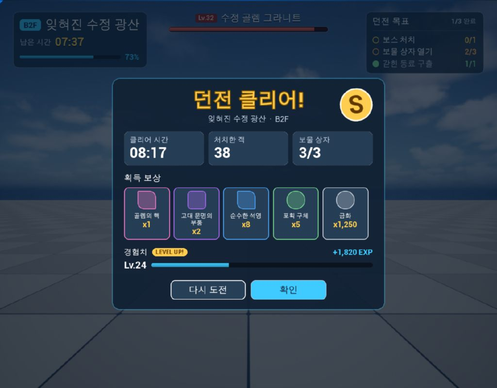

# Dungeon UI — Agent MCP 워크플로 검증 사례

[English](DungeonUi.md)

이 문서는 단순한 UI 스크린샷 모음이 아니라, **Claude Code가 Agent MCP의 Tool과 Skill을 이용해 UMG UI를 만들고 리뷰를 반영하며 구조를 개선한 과정**을 기록합니다.

몬스터 수집형 서바이벌 게임 느낌의 던전 진행 HUD와 던전 결과 팝업을 Agent MCP 테스트베드에서 제작했으며, 작업 중 **UMG Designer는 열지 않았습니다**.

## 무엇을 검증했는가

```text
Flat Widget Tree
      ↓ review
Reusable Widget Blueprint Components
+ C++ BindWidget Contracts
+ DynamicEntryBox
      ↓ review
Theme Data Asset
+ DataTable
+ Art Request Pipeline
+ Capture-based Review
```

이 사례에서 확인한 것은 다음과 같습니다.

- MCP Tool만으로 Widget Blueprint를 생성·편집하고 컴파일할 수 있는가
- C++ `BindWidget` 계약을 유지하면서 UI를 재구성할 수 있는가
- 반복 요소를 재사용 가능한 Widget Blueprint 컴포넌트로 분리할 수 있는가
- 고정 복사본 대신 데이터 기반 목록과 Theme Data Asset으로 확장할 수 있는가
- PIE와 viewport capture를 이용해 에이전트가 자신의 결과를 검토하고 다시 수정할 수 있는가
- Tool의 기능과 제작 규칙을 분리하여, 재사용 가능한 작업 규칙을 Skill로 제공할 수 있는가


## 최종 구조

| `/Game/Samples/DungeonUi` 아래 에셋 | C++ 클래스 | 역할 |
|---|---|---|
| `Components/WBP_RewardSlot` | `AgentMcpSampleRewardSlot` | 아이콘, 이름, 개수가 있는 재사용 보상 슬롯. 입력 `Reward`는 아이템 테이블의 행과 개수이고, 등급 색과 프레임은 테마에서 가져옴 |
| `Components/WBP_StatTile` | `AgentMcpSampleStatTile` | 큰 값 위에 라벨을 표시하는 재사용 통계 타일 |
| `Components/WBP_ObjectiveRow` | `AgentMcpSampleObjectiveRow` | 체크 표시, 라벨, 완료/전체를 표시하는 목표 행 |
| `WBP_DungeonHud` | `AgentMcpSampleDungeonHud` | 타이머와 진행도, 목표 행 인스턴스, 보스 체력 바를 조합한 HUD |
| `WBP_DungeonResult` | `AgentMcpSampleDungeonResult` | 통계 타일과 `DynamicEntryBox` 기반 보상 목록을 가진 결과 카드 |
| `WBP_DungeonDemo` | `UserWidget` | HUD와 결과 화면을 함께 보여 주는 데모 화면 |
| `Data/DA_DungeonUiTheme` | `AgentMcpSampleUiTheme` | 텍스트·상태·등급 색과 프레임 브러시를 모은 Theme Data Asset |
| `Data/DT_DungeonItems` | `AgentMcpSampleItemRow` | 이름, 등급, 아이콘 텍스처와 fallback 표현을 가진 아이템 테이블 |

C++ 클래스는 `Source/AgentMcpTestbed`에 있습니다.

## 실행

[테스트베드와 smoke 테스트](../../README.ko.md#테스트베드와-smoke-테스트)대로 테스트베드를 연 뒤 다음 도구를 호출합니다.

```text
pie_start
sample_show_widget {"widgetClass": "/Game/Samples/DungeonUi/WBP_DungeonDemo.WBP_DungeonDemo_C"}
viewport_capture
pie_stop
```

`viewport_capture` 전에 등장 연출이 끝나도록 약 3초 기다립니다.

## 1. 첫 버전 — 동작하지만 유지보수하기 어려운 UI

초기 요청은 상용 게임처럼 보이는 HUD와 결과 팝업이었습니다. Claude Code는 데이터와 연출을 맡는 C++ 부모 클래스를 작성하고, 각 화면을 `umg_add_widgets` 한 번으로 생성했습니다.

- HUD: 48 widgets
- 결과 팝업: 78 widgets

브러시, 폰트, 슬롯 배치까지 한 번에 넣었기 때문에 화면은 빠르게 만들어졌지만 구조는 평평했습니다.

### 실행 결과에서 찾은 Tool 문제

첫 `viewport_capture`에서 진행 바가 파랗게 물들어 있었습니다. `ProgressBar`는 fill brush에 `FillColorAndOpacity`를 곱하고 기본값이 파란색이기 때문에, `umg_set_widget_properties`로 흰색을 지정해 해결했습니다.

더 중요한 문제는 Tool output이었습니다. 두 `umg_add_widgets` 호출이 약 3만 자와 5만 2천 자를 반환했고, 두 번째는 Claude Code의 Tool output 한도를 넘었습니다. 원인은 요청하지 않은 구조체 필드까지 모두 read-back한 것이었습니다.

이를 수정해 **변경 요청에 포함된 필드만 결과로 다시 반환**하도록 바꾸고 Live Coding 및 smoke test로 검증했습니다.

즉 이 샘플은 UI만 만든 것이 아니라 실제 에이전트 사용 과정에서 Tool 자체의 출력 설계도 개선했습니다.

## 2. 첫 리뷰 — 화면은 완성됐지만 구조가 재사용되지 않음

첫 버전에 대한 리뷰에서 다음 문제가 드러났습니다.

- 보상 슬롯 5개가 복사본
- 통계 타일 3개가 복사본
- 목표 행 3개가 복사본
- 브러시 38개가 화면 안에 인라인으로 정의됨
- 보상 목록이 데이터 수에 따라 늘어날 수 없음

문제는 `umg_add_widgets`의 기능이 부족해서가 아니었습니다. **에이전트에게 “어떤 UI 구조를 만들어야 하는가”에 대한 작업 규칙이 없었던 것**이 핵심이었습니다.

## 3. Tool과 Skill의 책임 분리

반복 요소를 컴포넌트로 만들고 데이터를 분리하는 방식은 Tool의 기능이 아니라 프로젝트의 제작 관례입니다. 그래서 해당 규칙을 Tool description에 계속 추가하지 않고 [`umg-authoring`](../../Plugins/AgentMcp/Skills/umg-authoring/SKILL.md) Skill로 분리했습니다.

Tool은 다음만 책임집니다.

- Widget Blueprint를 조사한다.
- Widget Tree를 생성·편집한다.
- BindWidget 계약을 검증한다.
- 컴파일·PIE·capture를 실행한다.

Skill은 다음을 안내합니다.

- 반복 요소를 별도 Widget Blueprint 컴포넌트로 만든다.
- C++ `BindWidget` 계약을 유지한다.
- 동적인 항목은 `DynamicEntryBox`, `ListView`, `TileView` 등 데이터 기반 목록으로 만든다.
- 스타일 값은 Theme Data Asset으로 모은다.
- 변경 후 PIE capture로 검토한다.

처음에는 `.claude/skills`의 Claude Code 전용 Skill이었지만, 이후 플러그인이 `skills_get`으로 Skill을 직접 제공하도록 구현해 Codex와 다른 MCP client도 같은 지침을 읽을 수 있게 했습니다.

## 4. 두 번째 버전 — 컴포넌트와 데이터

`umg-authoring` Skill을 따라 UI를 다시 구성했습니다.

1. **계획**
   - 컴포넌트: Reward Slot, Stat Tile, Objective Row
   - 데이터: `Reward`, Label/Value, Done/Total
   - 동적 목록: Rewards

2. **C++ 부모 클래스**
   - `BindWidget` 계약
   - `NativePreConstruct`에서 적용되는 인스턴스 입력
   - runtime setter
   - 화면은 컴포넌트 내부 위젯을 직접 만지지 않고 컴포넌트에 데이터만 전달

3. **컴포넌트 Widget Blueprint**
   - `umg_create_widget_blueprint`
   - `umg_add_widgets`
   - `blueprint_compile`

4. **기존 화면 재구성**
   - `umg_remove_widgets` dry run으로 삭제 대상과 영향 확인
   - HUD의 복사된 하위 트리 19개, 결과 팝업의 48개를 제거
   - Reward Slot, Stat Tile, Objective Row 인스턴스로 교체
   - 보상은 `DynamicEntryBox` + `EntryWidgetClass`로 변경

5. **검토**
   - 컴포넌트부터 순서대로 `blueprint_compile`
   - `pie_start`
   - `sample_show_widget`
   - `viewport_capture`
   - `pie_stop`
   - 최종적으로 `asset_save`

이 과정에서 smoke test에도 다음 경로를 추가했습니다.

- Widget Blueprint 인스턴스에 instance property 설정
- `DynamicEntryBox` entry class 설정
- Widget Blueprint가 자기 자신을 포함하려는 요청 거부

## 5. 세 번째 버전 — 표현을 코드에서 데이터로 이동

다음 리뷰는 **코드 수정 없이 스타일과 표현을 바꿀 수 있어야 한다**는 요구였습니다.

이를 위해 세 가지 Tool을 추가했습니다.

- `asset_create`
- `asset_import_textures`
- 프로젝트 asset까지 수정할 수 있도록 확장한 `object_set_properties`

그리고 구조를 다음처럼 변경했습니다.

1. 색 상수를 Theme Data Asset 클래스로 이동
2. 아이템 정보를 DataTable로 이동
3. Reward는 아이템 테이블의 행 + count만 보유
4. 아이콘이 없을 때는 fallback shape 사용
5. 결과 팝업 motion 값도 데이터로 노출

`asset_create`로 `DA_DungeonUiTheme`과 `DT_DungeonItems`를 만들고 `datatable_add_rows`로 아이템을 추가했습니다.

`object_set_properties`로 테마의 Accent와 Legendary color를 변경한 뒤 다시 capture했을 때 **C++ build 없이 플레이 화면의 색이 즉시 바뀌는 것**을 확인했습니다.



## 6. UI Art 파이프라인으로 확장

Theme과 DataTable로 옮길 수 없는 이미지 자산은 [`Art/Requests/dungeon_ui.json`](../../Art/Requests/dungeon_ui.json)에 별도 요청으로 정의했습니다.

현재 요청에는 다음이 포함됩니다.

- 아이템 아이콘 5개
- 희귀 / 영웅 / 전설 슬롯 프레임
- 결과 카드 패널

각 항목에는 크기, alpha 여부, 9-slice border, target texture path, 실제 연결 위치가 기록됩니다.

[`ui-art-requests`](../../Plugins/AgentMcp/Skills/ui-art-requests/SKILL.md) Skill은 이를 다음 과정으로 연결합니다.

```text
UI Agent
  ↓ request JSON
Image Model / Agent / Artist
  ↓ delivered image
Automated Review
  ↓
Texture Import
  ↓
Data / Theme / Widget connection
  ↓
PIE Capture
  ↓
User Review
```

이렇게 해서 UMG 제작 범위를 Widget Tree 조작에서 **UI 제작 협업 프로세스**까지 확장했습니다.

## 이 사례가 Agent MCP 설계에 준 영향

이 샘플은 완성된 UI를 보여 주기 위한 데모이면서 동시에 Agent MCP 자체의 설계 테스트였습니다.

- 지나치게 큰 Tool result → 요청 필드만 read-back하도록 개선
- flat UI → 제작 규칙을 `umg-authoring` Skill로 분리
- Claude Code 전용 Skill → MCP 서버가 Skill을 제공하도록 확장
- 인라인 스타일 → Theme Data Asset과 DataTable Tool 추가
- placeholder art → `ui-art-requests` workflow 추가
- 결과를 대화로 추측 → PIE + viewport capture 기반 검토

즉, **실제 에이전트 작업을 돌려 보고 실패한 지점을 Tool과 Skill 설계로 다시 환류**한 사례입니다.

## 현재 다루지 않는 것

- UMG Widget Animation 생성·편집은 아직 지원하지 않습니다. 관련 실험은 [WidgetAnimationAuthoring.md](../Experiments/WidgetAnimationAuthoring.md)에 정리되어 있습니다.
- 아트 요청의 일부 이미지는 아직 placeholder shape 상태입니다.
- 위젯을 다른 부모로 직접 이동하는 Tool은 아직 없어서, 구조 변경 시 기존 subtree를 제거하고 동일 이름의 component instance를 다시 추가합니다.
