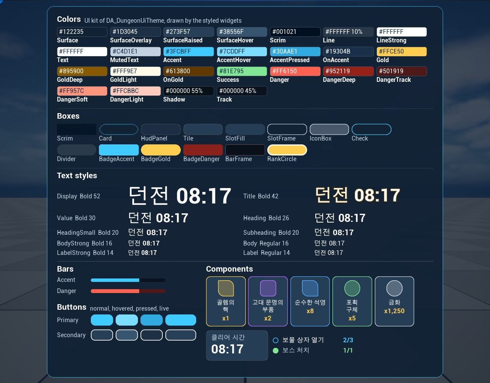

# UI 스타일 시스템

[English](UiStyleSystem.md)

던전 UI 샘플은 겉모습을 작은 디자인 시스템으로 관리합니다. 테마 데이터 에셋에 색·반경 토큰과 이름 붙인 스타일이 있고, 위젯은
브러시와 폰트 대신 스타일 이름을 저장하며, 키트 갤러리가 이 모든 것을 한 화면에 보여 줍니다. 에이전트는 Agent MCP 도구와
[`ui-style-system`](../Plugins/AgentMcp/Skills/ui-style-system/SKILL.md) 스킬의 스크립트로 이것을 만들고, 바꾸고, 확인합니다. 이
문서는 구성 요소와 작업 방법, 샘플을 이 시스템으로 옮긴 과정을 설명합니다.



- [왜 필요했나](#왜-필요했나)
- [테마](#테마)
- [스타일 위젯](#스타일-위젯)
- [키트 갤러리](#키트-갤러리)
- [스크립트 사용](#스크립트-사용)
- [스타일 바꾸기](#스타일-바꾸기)
- [샘플을 옮긴 과정](#샘플을-옮긴-과정)
- [한계](#한계)

## 왜 필요했나

샘플의 첫 세 버전은 대화하면서 요청 하나씩 만들었고, 화면마다 제각각의 값이 생겼습니다. 아트 요청의 이미지를 연결해 보니 이미지끼리도,
화면과도 어울리지 않았고, 화면에는 맞춰야 할 하나의 스타일이 없었습니다. 바꾸기 전과 후에 `style_extract.py`가 위젯 블루프린트에서
찾은 값입니다.

| 위젯 블루프린트에서 찾은 것 | 전 | 후 |
|---|---|---|
| 테마 스타일을 쓰는 그리는 위젯 | 없음 | 화면과 부품의 47개 중 46개(갤러리를 합치면 60개 중 59개), 스타일 28개 |
| 위젯에 직접 넣은 색 | 72번 쓰인 색이 30개 묶음, 그중 9개는 비슷한 색의 중복. 흰 외곽선 하나가 투명도 10, 12, 25, 45%로 쓰임 | 없음 |
| 글자 크기 | 14가지. 18/19/20, 13/14/15/16처럼 거의 같은 크기 포함 | 없음(텍스트 스타일은 7가지 크기) |
| 모서리 반경 | 9가지: 0, 6, 8, 9, 12, 14, 16, 24, 알약형 | 없음(토큰은 8, 14, 24, 알약형) |
| 선 굵기 | 4가지: 1, 1.5, 2, 4 | 없음(박스 스타일은 1, 2, 4) |
| 간격 | 17가지, 4 단위에 맞는 것 43% | 7가지, 모두 4 단위 |

스타일이 없는 그리는 위젯 하나는 코드가 채우는 보상 슬롯의 아이콘 이미지입니다.

웹 팀은 디자인 토큰, 컴포넌트 라이브러리, Storybook, 스크린샷 테스트로 화면을 일관되게 유지합니다. 샘플은 같은 방식을 언리얼 요소로
씁니다.

| 웹 방식 | 던전 UI 샘플 |
|---|---|
| 디자인 토큰 | 테마 데이터 에셋의 `Colors`, `Radii` |
| CSS 클래스 | 테마의 박스·텍스트·바·버튼 스타일. 스타일 위젯이 `Style` 이름으로 적용 |
| 컴포넌트 라이브러리 | `Components`의 `WBP_RewardSlot`, `WBP_StatTile`, `WBP_ObjectiveRow` |
| Storybook | `WBP_UiKitGallery` |
| 스크린샷 테스트(Chromatic, Playwright) | `capture_compare.py`로 비교하는 플레이 캡처 |
| 토큰 점검(CSS Stats, stylelint) | `style_extract.py` |
| 이미지에서 테마 만들기(Material Theme Builder) | `style_palette.py` |

## 테마

`Source/AgentMcpTestbed/Public/AgentMcpSampleUiTheme.h`의 `UAgentMcpSampleUiTheme`은 데이터 에셋 클래스이고,
`Content/Samples/DungeonUi/Data/DA_DungeonUiTheme`이 그 에셋입니다. `Config/DefaultGame.ini`가 에셋을 지정하고, 지정이 없으면 위젯은
같은 값을 가진 클래스 기본값을 씁니다.

| 프로퍼티 | 내용 |
|---|---|
| `Colors` | 선형 공간의 색 25개, 투명도 포함. 표면: `Surface`, `SurfaceOverlay`, `SurfaceRaised`, `SurfaceHover`, `Scrim`. 선: `Line`, `LineStrong`. 텍스트: `Text`, `MutedText`. 강조: `Accent`, `AccentHover`, `AccentPressed`, `OnAccent`. 금색: `Gold`, `GoldDeep`, `GoldLight`, `OnGold`. 상태: `Success`, `Danger`, `DangerDeep`, `DangerTrack`, `DangerSoft`, `DangerLight`. 효과: `Shadow`, `Track` |
| `Radii` | `Small` 8, `Medium` 14, `Large` 24, 그리고 음수 값으로 양 끝을 높이의 절반만큼 둥글게 하는 `Pill` |
| `Boxes` | `Card`, `HudPanel`, `Tile`, `SlotFrame`, `BadgeGold`, 버튼 상태별 박스 같은 박스 스타일 20개. 채움 토큰과 투명도, 선 토큰·투명도·굵기, 반경 토큰, 선택적인 내용 패딩 |
| `Texts` | `Display`(52)부터 `Label`(14)까지 텍스트 스타일 10개. `Body`, `Label` 말고는 굵은 글꼴. 폰트(비어 있으면 Roboto), 서체, 크기, 기본 색 토큰, 그림자·외곽선 토큰 |
| `Bars` | `Accent`, `Danger`. 트랙·채움·반경 토큰 |
| `Buttons` | `Primary`, `Secondary`. 보통·호버·눌림·비활성 상태마다 박스 스타일. 호버 박스가 없으면 보통 박스, 눌림 박스가 없으면 호버 박스, 비활성 박스가 없으면 보통 박스를 반투명으로 씀 |
| `Common`~`Legendary` | 등급마다 색과 선택적인 프레임 브러시. 보상 슬롯의 코드가 적용 |

스타일은 토큰을 이름으로 가리킵니다. 데이터가 정하는 상태의 색은 코드도 같은 방법으로 읽습니다:
`UAgentMcpSampleUiTheme::Get().GetColor(TEXT("Success"))`. 목표 행은 진행 중인 목표와 완료한 목표의 색을 이렇게 정하고, HUD 타이머는
마지막 1분에 `Text`와 `Danger` 사이에서 깜빡입니다. 테마에 없는 색 토큰은 마젠타로 그려서 오타가 화면에 드러납니다.

## 스타일 위젯

`Source/AgentMcpTestbed/Public/AgentMcpSampleStyledWidgets.h`는 UMG 위젯 4가지에 스타일 이름을 더합니다. 위젯은 프로퍼티가 동기화될
때마다, 디자이너에서도 게임에서도 스타일을 적용하고, 디자이너 팔레트의 **Sample Styles**에 있습니다.

| 클래스 | 더하는 것 | 스타일이 정하는 것 |
|---|---|---|
| `AgentMcpSampleStyledBorder` | 박스 스타일 `Style` | 배경 브러시, 스타일에 패딩이 있으면 내용 패딩 |
| `AgentMcpSampleStyledText` | 텍스트 스타일 `Style`, 색 토큰 `Color` | 폰트, 색(위젯의 토큰, 없으면 스타일의 토큰), 그림자 |
| `AgentMcpSampleStyledProgressBar` | 바 스타일 `Style` | 트랙·채움 브러시, 채움 틴트는 흰색 |
| `AgentMcpSampleStyledButton` | 버튼 스타일 `Style` | 네 상태의 브러시 |

위젯 블루프린트에는 이름만 저장되고, umg 도구는 다른 프로퍼티처럼 이름을 설정합니다.

```json
{"class": "/Script/AgentMcpTestbed.AgentMcpSampleStyledText", "name": "TimerText", "properties": {"Style": "Heading", "Color": "Gold"}}
```

등급 프레임이나 타이머 깜빡임처럼 나중에 코드가 브러시나 색을 정하면 코드가 이깁니다. 스타일이 없거나 테마에 없는 스타일 이름을 가진
위젯은 자기 값을 유지합니다.

**CommonUI**는 같은 문제를 `UCommonTextStyle`, `UCommonBorderStyle`, `UCommonButtonStyle`로 풉니다. 이것들은 추상 블루프린트
클래스여서 스타일마다 블루프린트 하위 클래스를 만들고 클래스 기본값에 값을 넣습니다. Agent MCP 도구는 이런 블루프린트 클래스를 만들거나
클래스 기본값을 고칠 수 없지만, 데이터 에셋은 `object_get_properties`와 `object_set_properties`로 읽고 고칠 수 있습니다. CommonUI
프로젝트는 사람이 만든 스타일 클래스를 그대로 두고, 이 문서의 나머지 내용은 그대로 쓸 수 있습니다.

## 키트 갤러리

`Content/Samples/DungeonUi/WBP_UiKitGallery`는 샘플의 Storybook입니다. C++ 부모 클래스 `AgentMcpSampleUiKitGallery`가 위젯이 만들어질
때마다, 디자이너에서도 테마로 패널 5개를 채우므로, 새 토큰이나 스타일은 갤러리를 고치지 않아도 나타납니다.

| 이름으로 바인딩한 패널 | 항목 |
|---|---|
| `ColorList` | 색마다 16진수 값과 투명도가 적힌 견본 |
| `BoxList` | 버튼 상태 박스를 뺀 박스 스타일마다 견본 |
| `TextList` | 텍스트 스타일마다 견본 문장과 스타일 이름·서체·크기 |
| `BarList` | 65%로 채운 바 스타일마다 견본 |
| `ButtonList` | 버튼 스타일마다 보통·호버·눌림 박스와 실제로 동작하는 버튼 |

위젯 블루프린트는 패널을 배치하고, 상태별 부품 인스턴스를 넣습니다. 등급마다 보상 슬롯, 통계 타일, 진행 중인 목표와 완료한 목표입니다.
캡처는 스크롤할 수 없으므로 페이지는 1280 × 1200 고정 크기이고, 줄이기만 하는 스케일 박스 안에 있습니다. 테스트베드의 1144 × 894
플레이 뷰포트에서는 약 72% 크기로 그려집니다. 이 배율에서는 보상 슬롯 두 개의 이름이 두 줄로 넘어가는데, 작은 UI 배율에서 슬롯이
실제로 이렇게 보입니다.

다른 화면처럼 띄웁니다.

```
pie_start {"windowWidth": 1144, "windowHeight": 894}
sample_show_widget {"widgetClass": "/Game/Samples/DungeonUi/WBP_UiKitGallery.WBP_UiKitGallery_C"}
viewport_capture
pie_stop
```

## 스크립트 사용

스크립트는 `Plugins/AgentMcp/Skills/ui-style-system/scripts`에 있습니다. Python 표준 라이브러리만 쓰고, 실행한 폴더의 `Saved/UiStyle`에
보고서를 쓰므로 프로젝트 폴더에서 실행합니다. Git Bash에서는 `MSYS_NO_PATHCONV=1`을 설정해야 `/Game` 인자가 윈도우 경로로 바뀌지
않습니다.

**`style_extract.py`**는 서버를 통해 폴더의 위젯 블루프린트와 테마를 읽고 HTML·JSON 보고서를 씁니다. 스타일별 스타일 위젯, 자기
모양을 가진 위젯, 쓰인 곳과 맞는 토큰이 붙은 색 묶음, 비슷한 색의 중복, 글자 크기, 반경, 선 굵기, 4·8 단위에 맞는 정도를 포함한 간격,
고정 크기, 텍스처를 보여 줍니다.

```
python Plugins/AgentMcp/Skills/ui-style-system/scripts/style_extract.py --url http://127.0.0.1:18766/mcp --path /Game/Samples/DungeonUi --theme /Game/Samples/DungeonUi/Data/DA_DungeonUiTheme.DA_DungeonUiTheme
```

값은 Slate가 그리는 대로 셉니다. UMG 버튼 브러시의 기본값인 `bUseBrushTransparency`가 켜진 외곽선은 자기 색이 아니라 채움의 투명도로
그려집니다. 코드가 실행 중에 넣는 색은 위젯 블루프린트에 없습니다.

**`style_palette.py`**는 스타일 프레임 이미지에서 바탕색, 밝은 색, 강조색을 sRGB와 선형 값으로 뽑습니다. `--compare`에 추출 보고서를
주면 색마다 위젯 블루프린트에서 가장 가까운 색과 그 토큰을 붙입니다.

```
python Plugins/AgentMcp/Skills/ui-style-system/scripts/style_palette.py Art/Style/style_frame_dungeon_result.png --compare Saved/UiStyle/<extraction>.json
```

**`capture_compare.py`**는 크기가 같은 캡처 두 장을 비교합니다. 영역 안의 평균 차이와 바뀐 픽셀 비율을 알려 주고, 바뀐 픽셀을 빨갛게
표시한 HTML 보고서를 씁니다.

```
python Plugins/AgentMcp/Skills/ui-style-system/scripts/capture_compare.py before.png after.png --region 258 150 886 740 --name result_card
```

## 스타일 바꾸기

- **값 하나.** `object_set_properties`로 테마 에셋을 고칩니다. 구조체 값에는 바꿀 필드만 적어도 되지만 맵 값은 맵 전체를 대신합니다.
  `object_get_properties`로 맵을 읽고, 항목을 고친 뒤, 맵 전체를 씁니다. 되읽은 맵 키는 선언한 대로(`LineStrong`) 나옵니다. 이름은
  대소문자를 구분하지 않지만, 선언한 대로 적으세요.
- **새 토큰이나 스타일.** 해당 맵에 추가하고 이름을 씁니다. 새 필드나 다른 클래스용 스타일 위젯 같은 새 종류의 스타일만 C++와, 에디터를
  닫은 빌드가 필요합니다.
- **반영 시점.** 스타일 위젯은 동기화될 때 테마를 읽으므로, 바뀐 값은 다음에 위젯이 만들어질 때, 예를 들어 다음 플레이 세션에서 보입니다.
- **갤러리 먼저.** 바꾸기 전과 후에 갤러리를 캡처해 비교하고, 그다음 바뀐 스타일을 쓰는 화면을 확인합니다.
- **클래스 기본값.** 테마 클래스의 생성자에는 에셋과 같은 값이 있습니다. 테마를 지정하지 않았을 때의 대체값이고, 새 테마 에셋의 시작 값입니다.

## 샘플을 옮긴 과정

스킬은 두 방향을 제시합니다. 목업 이미지인 스타일 프레임 쪽으로 옮기거나, 지금 모양을 유지하면서 정리하는 것입니다. 사용자는 모양을
유지하는 쪽을 골랐습니다.

1. **토큰.** 추출 결과에서 거의 같은 값의 묶음마다 토큰이나 스타일 하나를 만들었습니다. 흰 외곽선의 투명도 네 가지는 `Line`과
   `LineStrong`이 됐고, 글자 크기 14가지는 7가지 크기의 텍스트 스타일 10개가, 반경 9가지는 세 가지와 `Pill`이 됐습니다.
2. **C++.** 테마 맵, 스타일 위젯, 갤러리 부모 클래스를 만들고 에디터를 닫고 빌드했습니다.
3. **기준 캡처.** 위젯 블루프린트를 바꾸기 전에 데모 화면을 플레이 캡처했습니다.
4. **트리 다시 만들기.** 도구는 위젯의 클래스를 바꿀 수 없습니다. 스크립트가 `umg_inspect`로 위젯 블루프린트 5개를 읽고, 모든 `Border`,
   `TextBlock`, `ProgressBar`, `Button`을 스타일 클래스와 스타일 이름으로 바꾸고, 스타일이 정하는 브러시·폰트·색 값을 빼고, 슬롯 패딩을
   4 단위로 맞췄습니다(10 → 12, 22 → 24 등). 위젯 블루프린트마다 `umg_remove_widgets`로 루트를 지우고 `umg_add_widgets`로 같은 이름의
   새 트리를 넣어서 모든 `BindWidget`이 그대로 연결됐습니다. 추가가 실패하면 삭제를 되돌리게 했습니다. 5개 모두 오류 없이 컴파일됐습니다.
5. **검토.** 바꾼 뒤의 데모 화면 캡처를 기준 캡처와 비교했습니다.
   - 배치와 내용은 같았습니다. 결과 카드는 1144 × 894 캡처에서 535 px에서 569 px로 34 px 커졌습니다. 4 단위로 맞춘 패딩과 글자 크기
     단계(18 → 20, 13 → 14) 때문입니다. 제목 아래가 모두 움직여서 `capture_compare.py`는 카드 영역의 24%를 바뀐 것으로 표시했고, 검토는
     눈으로 했습니다.
   - 바꾼 뒤 첫 캡처에서는 두 버튼이 흐려 보였습니다. 같은 세션의 3초 캡처와 6초 캡처는 카드의 3%만 달랐고, 모두 버튼과 경험치 숫자였습니다.
     3초 캡처가 등장 연출의 페이드 인 중간을 찍은 것입니다. 연출은 2.75초지만 새 플레이 세션에서는 늦게 시작할 수 있습니다. 이제 연출이
     끝난 뒤에 캡처합니다.
   - 6초 캡처에 실제 차이가 하나 남았습니다. 다시 도전 버튼의 외곽선이 흐렸습니다. 예전 브러시는 투명도 25%인 흰 외곽선에 UMG 버튼의
     기본값인 `bUseBrushTransparency`가 켜져 있었고, 이 설정이면 Slate는 외곽선을 채움의 투명도로 그립니다(SlateCore의
     `DrawElementTypes.cpp`). 그래서 화면에서는 불투명했습니다. `LineStrong`을 불투명한 흰색으로 바꾸고, 중복이 된 `LineHover`를 지우고,
     `style_extract.py`가 외곽선을 Slate가 그리는 대로 읽게 했습니다. 확인 버튼이 같은 기본값 때문에 갖고 있던 굵기 1의 회색 외곽선은
     일부러 뺐습니다.
6. **남은 값.** 다음 추출에서 그리드와 테마를 벗어난 값 두 개가 나왔습니다. 보스 목표의 강조색은 색 토큰 입력 `OpenColor`가 됐고, 보상
   목록의 항목 간격 10은 12가 됐습니다.
7. **갤러리.** 갤러리의 첫 배치는 플레이 뷰포트에 비해 너무 길어서 40% 크기로 그려졌고, 두 번째 배치는 뷰포트를 넘쳤습니다. 최종 페이지는
   고정 크기이고, 텍스트 스타일을 두 열로 놓고, 항목 너비를 가장 긴 이름에 맞췄습니다.

8. **확정.** 사용자가 갤러리를 승인했습니다. 갤러리, 결과 팝업, HUD 캡처를 `Art/Style/baseline/`의 기준으로 두고, 테마 값으로
   [Art/Style/ui_style.md](../Art/Style/ui_style.md)를 다시 썼습니다. `pie_start`가 정해진 크기의 플레이 창을 열 수 있게 된 뒤에는
   기준을 1144 × 894 창에서 다시 찍었습니다. 레벨 뷰포트 캡처는 에디터 창에 따라 달라지고, 창 캡처와 가장자리 픽셀이 3~7% 달랐습니다.

C++ 빌드 뒤의 모든 단계는 도구와 스크립트로 진행했고, UMG 디자이너는 열지 않았습니다.

## 한계

- 도구는 위젯의 클래스를 바꿀 수 없어서, 화면을 스타일 위젯으로 옮기려면 트리를 다시 만듭니다.
- 스타일 위젯은 보더, 텍스트, 진행 바, 버튼에만 있습니다. 이미지, 체크박스, 슬라이더, CommonUI 위젯용 스타일 클래스는 아직 없습니다.
- 추출은 위젯 블루프린트만 봅니다. 코드가 실행 중에 넣는 색은 코드에서 토큰으로 쓰고, 코드를 읽어서 확인합니다.
- 테마의 맵은 `object_set_properties`로 통째로만 쓸 수 있습니다.
- 기준 캡처는 1144 × 894 플레이 창(`pie_start`의 `windowWidth`, `windowHeight`)에서 찍었습니다. 비교할 캡처도 같은 창 크기로 찍어야
  합니다.
