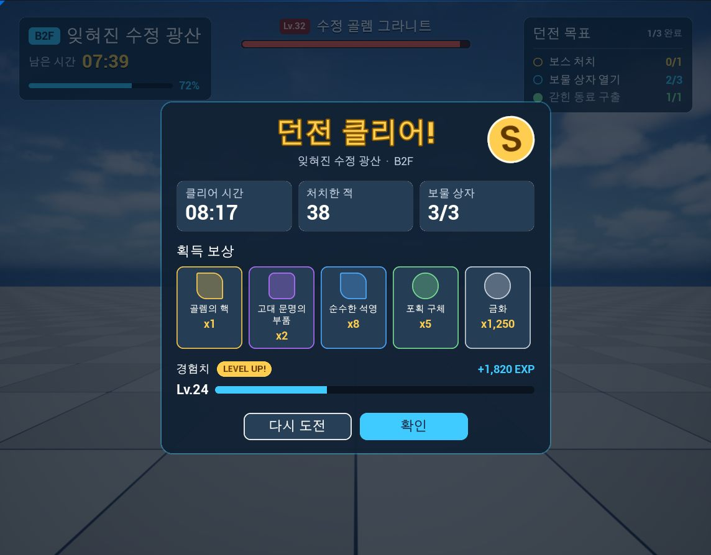
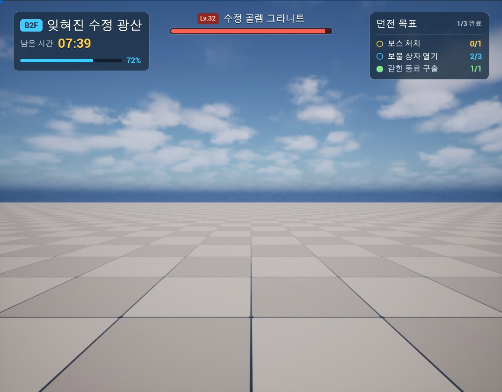

# Unreal Engine 5.5용 Agent MCP

[English](README.md)

Agent MCP는 Unreal Engine 5.5 에디터 안에서 [Model Context Protocol](https://modelcontextprotocol.io) 서버를 실행하여 Claude Code, Codex 같은 코딩 에이전트가 프로젝트를 **조사하고, 수정하고, 실행한 뒤 결과를 검증**할 수 있게 하는 에디터 플러그인입니다.

단순한 Unreal 원격 제어보다 **에이전트가 실제 게임 개발 작업을 수행하는 워크플로**에 초점을 맞췄습니다. Unreal Engine 5.8의 실험적 MCP/toolset 및 Agent Skill 개념을 참고하되, UE 5.5에서 동작하도록 새로 구현했고 Skill은 Claude Code·Codex와 호환되는 Markdown `SKILL.md` 형식으로 제공합니다.

## 핵심 특징

### Agent Skills

플러그인 자체가 작업 지침을 에이전트에게 제공합니다. Skill은 `SKILL.md`와 참고 파일·스크립트로 구성되며, 플러그인 기본 Skill 위에 프로젝트별 Skill을 덮어쓸 수 있습니다.

현재 포함된 Skill:

- `umg-authoring`: 재사용 가능한 Widget Blueprint 컴포넌트, C++ `BindWidget` 계약, 데이터 기반 목록, Theme Data Asset, 캡처 검토를 포함한 UMG 제작 규칙
- `ui-style-system`: 디자인 토큰, UI kit/gallery, 스타일 추출과 viewport capture 비교
- `ui-art-requests`: 이미지 모델·다른 에이전트·아티스트와 UMG 사이의 아트 요청 → 검수 → import → 연결 워크플로

### UMG 특화 도구

Widget Blueprint를 단순히 생성하는 데서 끝나지 않습니다.

- Widget Tree와 Named Slot 구조 분석
- C++ 부모 클래스의 `BindWidget` / `BindWidgetOptional` 계약과 실제 위젯 타입 검증
- Widget Blueprint 생성, 하위 트리 단위 추가, Widget/Slot 프로퍼티 변경
- 삭제 전 dry run과 바인딩·그래프 참조 영향 경고
- Blueprint compile → PIE → viewport capture → 수정의 반복 검증 루프

### Build → Run → Review

에이전트가 변경한 결과를 실행 화면으로 검증할 수 있도록 Blueprint/C++ 컴파일, Play In Editor, 로그 조회, viewport capture를 같은 MCP 서버에서 제공합니다.

```text
Inspect → Edit → Compile → PIE → Capture / Log → Review → Iterate
```

### Reflection 기반 Toolset

도구는 일반 `static UFUNCTION`입니다. 이름, 설명, 인자와 반환 JSON 스키마를 Unreal Reflection에서 생성하므로 Toolset에 함수를 추가하면 MCP 도구가 됩니다.

> **상태: 베타.** Windows 64비트의 Unreal Engine 5.5.4(설치형 빌드)로 빌드하고 테스트했습니다. 이 저장소의 smoke 테스트는 테스트베드 프로젝트에서 214개 검사를 통과합니다. 다른 엔진 버전과 플랫폼은 확인하지 않았습니다.

## Dungeon UI — 워크플로 검증 사례

`Content/Samples/DungeonUi`에는 Claude Code가 **UMG Designer를 열지 않고 Agent MCP Tool과 Skill로 제작한** 던전 진행 HUD와 결과 팝업이 있습니다.

첫 버전은 화면마다 48개/78개의 위젯을 한 번에 만든 평평한 트리였습니다. 동작은 했지만 반복 요소가 복사되어 있었고, 스타일 값이 인라인으로 흩어져 있었으며, 보상 목록도 데이터에 따라 늘어날 수 없었습니다.

리뷰를 반영하면서 제작 규칙을 `umg-authoring` Skill로 분리하고 UI를 다음 구조로 다시 만들었습니다.

```text
Flat Widget Tree
      ↓ review
Reusable Widget Blueprint Components
+ C++ BindWidget Contracts
+ DynamicEntryBox
      ↓ review
Theme Data Asset
+ DataTable
+ Art Request Pipeline
+ Capture-based Review
```





상세한 제작 과정과 반려된 버전에서 무엇을 고쳤는지는 [Dungeon UI 사례 문서](Docs/Samples/DungeonUi.ko.md)에 기록했습니다.

화면의 겉모습은 작은 디자인 시스템으로 관리합니다. 테마 데이터 에셋에 색·반경 토큰과 이름 붙인 박스·텍스트·바·버튼 스타일이 있고, 스타일 위젯은 스타일 이름만 저장하며, 키트 갤러리가 모든 토큰과 부품을 보여 줍니다. 에이전트가 `ui-style-system` 스킬의 스크립트로 스타일을 추출·적용·확인하는 방법은 [UI 스타일 시스템](Docs/UiStyleSystem.ko.md)에 있습니다.

## 문서 바로가기

- [설치](#설치)
- [클라이언트 연결](#클라이언트-연결)
- [도구](#도구)
- [스킬](#스킬)
- [안전장치](#안전장치)
- [설정](#설정)
- [도구 만들기](#도구-만들기)
- [테스트베드와 smoke 테스트](#테스트베드와-smoke-테스트)
- [한계](#한계)
- [배경](#배경)
- [라이선스](#라이선스)

## 설치

1. `Plugins/AgentMcp` 폴더를 프로젝트의 `Plugins` 폴더에 복사합니다.
2. **Edit > Plugins**에서 plugin을 켜거나, `.uproject` 파일에 추가합니다.
   ```json
   "Plugins": [ { "Name": "AgentMcp", "Enabled": true } ]
   ```
3. 프로젝트의 에디터 타깃을 빌드하고(plugin은 소스 코드로 배포됩니다) 에디터를 엽니다.

에디터 로딩이 끝나면 출력 로그에 다음 줄이 나옵니다.

```
LogAgentMcpProtocol: Agent MCP server listening on http://127.0.0.1:18765/mcp (39 tools).
```

## 클라이언트 연결

서버는 `http://127.0.0.1:18765/mcp`에서 MCP Streamable HTTP(JSON 응답)로 통신합니다.

Claude Code에서는 프로젝트 루트에 `.mcp.json` 파일을 추가합니다.

```json
{
  "mcpServers": {
    "unreal": { "type": "http", "url": "http://127.0.0.1:18765/mcp" }
  }
}
```

`AuthToken`을 설정했다면 서버 항목에 `"headers": { "Authorization": "Bearer <token>" }`를 추가합니다.

Codex에서는 프로젝트 루트에 `.codex/config.toml` 파일을 추가합니다. Codex는 신뢰한 프로젝트에서만 이 파일을 읽습니다. 폴더를 신뢰하면 `~/.codex/config.toml`에 그 폴더가 `trust_level = "trusted"`로 기록됩니다.

```toml
[mcp_servers.unreal]
url = "http://127.0.0.1:18765/mcp"
tool_timeout_sec = 600
```

`tool_timeout_sec`는 Codex의 기본 제한시간 60초를 늘립니다. 컴파일, 저장, 플레이 세션은 60초를 넘길 수 있습니다. `AuthToken`을 설정했다면 `http_headers = { Authorization = "Bearer <token>" }`를 추가하거나, 토큰이 든 환경 변수 이름을 `bearer_token_env_var`에 적습니다. 파일을 바꾼 뒤에는 Codex 세션을 새로 시작합니다.

서버는 `initialize` 응답으로 짧은 사용 안내와 스킬 목록을 보냅니다. 에이전트는 `editor_get_state`로 작업을 시작하는 것이 좋습니다.

**에디터마다 포트 하나.** plugin을 켠 에디터는 모두 설정된 포트를 씁니다. 에디터 두 개를 동시에 실행하면 두 번째 에디터는 포트를 열지 못해 `Agent MCP server failed to start`를 기록하고 도구를 제공하지 않습니다. 동시에 여는 프로젝트에는 서로 다른 포트를 지정하고, 무언가를 바꾸기 전에 `editor_get_state`의 `project` 값을 확인하세요.

## 도구

**Read** 도구는 부작용이 없습니다. **Write** 도구는 되돌릴 수 있는 에디터 트랜잭션 안에서 실행되고, Play In Editor 중에는 거부됩니다. **Destructive** 도구는 `bConfirm`이 true가 아니면 무엇을 할지 보고만 하는 Write 도구입니다. **Control** 도구는 플레이 세션, 컴파일, 저장, 에셋 생성과 가져오기처럼 되돌릴 수 없는 에디터 상태를 바꿉니다.

| 도구 | 접근 | 설명 |
|---|---|---|
| `editor_get_state` | Read | 열린 레벨, 플레이 세션, 저장 안 된 패키지, 선택, undo 기록, 서버 상태 |
| `editor_undo`, `editor_redo` | Control | 마지막 에디터 트랜잭션 되돌리기와 다시 실행 |
| `log_get_recent` | Read | 시퀀스 번호 이후의 에디터 로그. 로그 수준, 카테고리, 텍스트로 거르기 |
| `actor_find` | Read | 레이블이나 이름, 클래스, 태그, 폴더, 선택으로 액터 찾기(에디터 또는 플레이 월드) |
| `actor_inspect` | Read | 액터의 클래스, 블루프린트, 태그, 트랜스폼, 부착 관계, 컴포넌트 |
| `actor_set_transform` | Write | 액터 이동, 회전, 크기 조절 |
| `actor_spawn` | Write | 메시·블루프린트 에셋이나 네이티브 클래스로 액터를 배치. 레이블, 트랜스폼, 폴더, 프로퍼티 지정 |
| `actor_duplicate` | Write | 고정 간격으로 줄지어 복제하거나, 주어진 트랜스폼마다 복제 |
| `actor_attach` | Write | 액터를 다른 액터에, 필요하면 소켓에 부착 |
| `actor_set_folder` | Write | 액터를 World Outliner 폴더로 이동 |
| `actor_delete` | Destructive | 액터와 거기 붙어 있는 액터를 함께 삭제 |
| `level_new` | Control | 빈 레벨이나 템플릿으로 레벨을 만들어 저장하고 연다 |
| `level_open` | Control | 에디터에서 레벨을 연다 |
| `level_save` | Control | 에디터에 열린 레벨, 또는 저장 안 된 모든 레벨을 저장 |
| `object_list_properties` | Read | 객체의 프로퍼티와 변경 가능 여부 |
| `object_get_properties` | Read | 프로퍼티 값을 JSON으로 읽기 |
| `object_set_properties` | Write | 에디터 레벨의 액터·컴포넌트나, 데이터 에셋·텍스처 같은 프로젝트 에셋의 프로퍼티 변경과 변경 후 값 확인 |
| `pie_start`, `pie_stop` | Control | Play In Editor를 시작하거나 종료하고, 세션이 시작되거나 끝날 때까지 대기. `pie_start`는 레벨 뷰포트에서 실행하고, `windowWidth`와 `windowHeight`를 주면 뷰포트가 그 크기인 새 창에서 실행 |
| `pie_status` | Read | 플레이 세션이 시작 중인지, 실행 중인지 |
| `asset_find` | Read | 폴더, 클래스, 이름으로 에셋 찾기(에셋을 로드하지 않음) |
| `asset_inspect` | Read | 에셋의 클래스, 태그, 파일 크기, 로드·변경 상태, 참조 수 |
| `asset_referencers`, `asset_dependencies` | Read | 에셋을 참조하는 패키지, 에셋이 의존하는 패키지 |
| `asset_save` | Control | 로드된 프로젝트 에셋을 대화상자 없이 저장 |
| `asset_create` | Control | 데이터 에셋이나 DataTable 생성 |
| `asset_import_textures` | Control | PNG, JPEG, TGA, BMP 파일을 UMG용 설정의 텍스처로 가져오기 |
| `class_find_derived` | Read | 클래스를 상속하는 C++·블루프린트 클래스와 헤더, 에셋 |
| `datatable_get_schema` | Read | 행 구조체, C++ 헤더, 열, C++ 타입, JSON 스키마 |
| `datatable_list_rows`, `datatable_get_rows` | Read | 행 이름, 행과 열로 정리한 값 |
| `datatable_set_rows`, `datatable_add_rows`, `datatable_rename_rows` | Write | 프로젝트 DataTable 행 변경, 추가, 이름 변경 |
| `datatable_remove_rows` | Destructive | 프로젝트 DataTable 행 삭제 |
| `blueprint_inspect` | Read | 부모 클래스 체인, 인터페이스, 컴포넌트, 변수, 함수, 그래프 |
| `blueprint_compile` | Control | 블루프린트나 위젯 블루프린트를 컴파일하고 오류와 경고 반환 |
| `umg_inspect` | Read | 슬롯을 포함한 위젯 트리, BindWidget 프로퍼티, 애니메이션, 프로퍼티 바인딩 |
| `umg_create_widget_blueprint` | Control | 부모 클래스와 루트 패널을 지정해 위젯 블루프린트 생성 |
| `umg_add_widgets` | Write | 위젯, 하위 트리 전체, 위젯 블루프린트 인스턴스를 위젯·슬롯 프로퍼티와 함께 한 번에 추가 |
| `umg_set_widget_properties` | Write | 여러 위젯의 프로퍼티, 슬롯 값, 변수 여부 변경 |
| `umg_remove_widgets` | Destructive | 위젯과 하위 위젯, 프로퍼티 바인딩, 그래프 참조 삭제 |
| `viewport_capture` | Read | 레벨 뷰포트나 플레이 세션의 PNG 캡처(게임 UI 포함) |
| `viewport_set_camera` | Control | 레벨 뷰포트 카메라를 특정 위치로 옮기거나 액터를 비춰, 다음 캡처에 나오게 함 |
| `livecoding_compile` | Control | 바뀐 C++를 Live Coding으로 컴파일하고 결과까지 대기 |
| `skills_list` | Read | 플러그인과 프로젝트의 스킬과 설명, 건너뛴 스킬 파일 |
| `skills_get` | Read | 스킬의 지침이나 스킬에 딸린 파일 하나 |

일반적인 검증 흐름: `blueprint_compile` → `pie_start` → 반환된 `startLogSequence`부터 `log_get_recent` → `viewport_capture` → `pie_stop`

UI를 만드는 흐름: `umg_create_widget_blueprint`(`BindWidget` 프로퍼티를 선언한 C++ 부모 클래스 지정) → `umg_add_widgets` → `blueprint_compile` → 플레이 세션에서 `viewport_capture`로 확인 → `umg_set_widget_properties`로 조정. 값은 JSON입니다. 프로퍼티 이름은 C++ 이름(`Text`, `Font`, `Padding`, `LayoutData`)을 쓰고, 구조체 값에는 바꿀 필드만 적어도 되며, enum 값은 이름(`HAlign_Center`, `RoundedBox`)으로 씁니다. 엔트리 클래스로 위젯 블루프린트를 쓸 수 있고, 그 인스턴스 속성도 같은 방식으로 설정합니다. 편집 도구는 요청한 필드만 되읽어 돌려주고, 전체 값은 `umg_inspect`의 `bIncludeProperties`로 확인합니다.

UI의 모양을 데이터로 두려면 `asset_create`로 테마 데이터 에셋이나 아이템 DataTable을 만들고, `object_set_properties`와 datatable 도구로 채우고, `asset_import_textures`로 아이콘과 프레임을 UMG용 텍스처 설정으로 가져옵니다.

## 스킬

스킬은 에이전트용 작업 지침입니다. `SKILL.md` 파일이 있는 폴더이고, 파일 앞머리(front matter)에 `name`과 `description`이 있습니다. Claude Code와 Codex가 자기 스킬에 쓰는 형식과 같습니다. 스킬은 에디터가 제공하므로 연결된 모든 에이전트가 같은 버전을 읽고, 플러그인을 옮기면 스킬도 따라갑니다.

- `initialize`가 돌려주는 서버 안내에 스킬마다 이름과 설명이 들어 있습니다.
- `skills_list`는 스킬과 그 폴더, 그리고 건너뛴 스킬 파일과 이유를 돌려줍니다.
- `skills_get`은 스킬의 지침과 폴더를 돌려주고, 요청하면 참고 자료나 예제 같은 딸린 파일도 돌려줍니다.

스킬은 다음 폴더에서 이 순서로 읽습니다. 뒤 폴더의 스킬이 앞 폴더의 같은 이름 스킬을 대신하므로, 프로젝트가 플러그인 스킬을 고쳐 쓸 수 있습니다.

1. `Plugins/AgentMcp/Skills`: 플러그인 스킬. 지금은 `umg-authoring`, `ui-art-requests`, `ui-style-system`
2. 프로젝트 폴더의 `AgentMcp/Skills`
3. `SkillDirectories` 설정의 폴더

파일은 호출할 때마다 새로 읽으므로 스킬을 고치면 에디터를 다시 시작하지 않아도 반영됩니다. 서버 안내에 들어가는 목록만 서버가 시작할 때 만들어집니다.

Claude Code와 Codex는 설명을 보고 스킬을 고릅니다. 서버 스킬도 스스로 시작하게 하려면, 같은 이름과 설명에 `skills_get`을 호출하라는 내용만 적은 짧은 `SKILL.md`를 Claude Code는 `.claude/skills/<이름>/`, Codex는 `.agents/skills/<이름>/`에 둡니다. 이 저장소에는 플러그인 스킬 모두 양쪽에 있습니다.

Unreal Engine 5.8도 Agent Skill 개념을 제공합니다. UE 5.8 쪽은 C++, Python, Blueprint로 정의한 `UAgentSkill`을 사용하고 Agent MCP는 Markdown 파일을 읽도록 별도로 구현했습니다. 그래서 Skill을 텍스트로 고칠 수 있고 Claude Code·Codex와 같은 형식을 공유합니다.

## 안전장치

- **로컬 전용.** 서버는 `127.0.0.1`에서만 연결을 받습니다. 브라우저의 `Origin`이 `localhost`, `127.0.0.1`, `[::1]`이 아니면 요청을 거부합니다. `AuthToken`을 설정하면 bearer 토큰도 요구합니다.
- **되돌릴 수 있고 전부 아니면 전무인 쓰기.** Write 도구는 무언가를 바꾸기 전에 모든 값을 검사하고, 에디터 트랜잭션 안에서 실행됩니다. 일부를 바꾼 뒤 실패하면 트랜잭션을 되돌립니다.
- **플레이 중 쓰기 금지.** Play In Editor가 시작 중이거나 실행 중이면 Write 도구와 에셋을 만들거나 가져오는 도구를 거부합니다.
- **프로젝트 콘텐츠만.** 에셋 생성, 가져오기, 변경, 저장은 `/Game`과 프로젝트 plugin 안에서만 합니다. 엔진 콘텐츠는 읽기 전용입니다.
- **명시적 저장.** 부수 효과로 저장하는 도구는 없습니다. 예외는 `level_new` 하나로, 레벨은 디스크에만 존재하므로 만든 레벨을 바로 씁니다. `asset_save`는 로드된 프로젝트 에셋만 저장하고 레벨은 여전히 거부합니다. 레벨은 `level_save`가 저장하며, 대상은 에디터에 열린 레벨입니다.
- **레벨을 말없이 교체하지 않음.** 레벨을 여는 순간 저장 안 된 변경이 사라지므로, `level_new`와 `level_open`은 저장 안 된 레벨 변경이 있으면 거부합니다.
- **dry run.** Destructive 도구는 `bConfirm: true`가 있어야 실제로 실행하고, `asset_import_textures`는 무엇이든 가져오기 전에 모든 항목을 검사합니다.
- **허용·차단 목록.** `AllowedTools`와 `BlockedTools`로 도구를 숨기고, `BlockedProperties`로 `object_set_properties`와 `umg` 도구가 바꾸지 못할 프로퍼티를 지정합니다.
- **파일.** `skills_get`은 스킬 폴더 안의 파일만 읽고, 그 밖의 경로와 숨김 파일은 거부합니다. `asset_import_textures`는 받은 이미지 파일을 읽으며, 프로젝트 폴더 밖의 파일도 읽습니다.
- 콘솔 명령이나 스크립트를 실행하는 도구는 없습니다.

## 설정

프로젝트의 `Config/DefaultEditorPerProjectUserSettings.ini`에 값을 적습니다.

```ini
[/Script/AgentMcpToolset.AgentMcpSettings]
Port=18765
+BlockedTools=datatable_remove_rows
```

| 키 | 기본값 | 의미 |
|---|---|---|
| `bAutoStartServer` | `True` | 에디터 로딩이 끝나면 서버 시작 |
| `Port` | `18765` | 루프백 포트 |
| `UrlPath` | `/mcp` | 엔드포인트 경로 |
| `AuthToken` | 비어 있음 | 설정하면 클라이언트가 `Authorization: Bearer <token>`을 보내야 함 |
| `ExposureMode` | `Native` | `Native`는 모든 도구를 등록. `ToolSearch`는 `toolsets_list`, `toolsets_describe`, `tools_call`만 등록 |
| `BlockedTools`, `AllowedTools` | 비어 있음 | 도구 이름 와일드카드(예: `datatable_*`) |
| `bAllowWritesDuringPIE` | `False` | Play In Editor 중 Write 도구 허용 |
| `BlockedProperties` | 비어 있음 | `object_set_properties`와 `umg` 도구가 거부할 `ClassName.PropertyName` 와일드카드 |
| `BusyWaitTimeoutSeconds` | `10` | 에디터가 저장, 가비지 수집, 에셋 로딩 중일 때 호출이 기다리는 시간 |
| `MaxResultBytes` | `65536` | 이 크기를 넘는 결과 텍스트는 잘림 |
| `LogBufferLines` | `20000` | `log_get_recent`용으로 보관하는 로그 줄 수 |
| `SkillDirectories` | 비어 있음 | 플러그인과 프로젝트 스킬 폴더 다음에 찾을 스킬 폴더. 상대 경로는 프로젝트 폴더 기준 |

## 도구 만들기

에디터 모듈의 의존성에 `AgentMcpToolset`을 추가하고, `UAgentMcpToolset` 하위 클래스에 static 함수를 선언합니다.

```cpp
#include "AgentMcpToolset.h"

#include "MyTools.generated.h"

USTRUCT(BlueprintType)
struct FMyGreeting
{
    GENERATED_BODY()

    UPROPERTY()
    FString Message;
};

UCLASS(meta = (McpToolset = "my"))
class UMyTools : public UAgentMcpToolset
{
    GENERATED_BODY()

public:
    UFUNCTION(BlueprintCallable, Category = "My Tools", meta = (AICallable, McpAccess = "Read", BlueprintInternalUseOnly = "true"))
    static FMyGreeting Greet(const FString& Name = TEXT("world"));
};
```

이 함수는 선택 문자열 인자 `name`을 받는 `my_greet` 도구가 됩니다.

- 툴셋 클래스는 자동으로 찾습니다. 도구 이름은 `<McpToolset>_<snake_case 함수 이름>`이고, 주석이 설명이 됩니다.
- `McpAccess`는 `Read`, `Write`, `Destructive`, `Control` 중 하나입니다. 지정하지 않으면 `Write`로 취급합니다.
- `BlueprintCallable`을 빼지 마세요. Unreal Engine 5.5는 블루프린트에서 호출 가능한 함수에만 C++ 기본 인자 값을 기록합니다.
- `USTRUCT(BlueprintType)`를 반환하세요. 필드가 JSON 결과가 됩니다.
- 실패는 `UE::AgentMcp::RaiseToolError(TEXT("CODE"), TEXT("Message"), TEXT("Hint"))`로 알립니다.
- 객체 인자(`UObject*`, `AActor*`, `UClass*`)는 오브젝트 경로를 받고, 액터는 레이블도 받습니다.
- 다음 프레임 이후에 끝나는 작업은 `UAgentMcpAsyncResult::Create(TimeoutSeconds, PollFunction)`를 반환합니다. Read와 Control 도구만 가능합니다.
- 이미지를 반환하려면 결과 구조체에 `FAgentMcpImage` 필드를 추가합니다.

## 테스트베드와 smoke 테스트

저장소 루트는 plugin을 빌드하고 테스트하는 작은 Unreal Engine 5.5 프로젝트입니다.

| 경로 | 내용 |
|---|---|
| `Plugins/AgentMcp` | plugin. 스킬은 `Plugins/AgentMcp/Skills`에 있음 |
| `Source/AgentMcpTestbed` | 테스트용 행 구조체, 데이터 에셋 클래스, 위젯 부모 클래스, 게임 모드, UI 샘플의 C++ 클래스 |
| `Source/AgentMcpTestbedEditor` | `/Game/AgentMcpFixtures` 아래에 테스트 에셋을 만드는 `testbed_*` 도구, 롤백·취소 검사용 훅, `sample_show_widget` |
| `Content/Samples/DungeonUi` | 도구로 만든 UI 샘플의 위젯 블루프린트, 테마 데이터 에셋, 아이템 테이블 |
| `Art/Requests` | 샘플의 아트 요청 |
| `Docs` | 샘플을 만든 과정과 계획한 실험 |
| `.mcp.json`, `.codex/config.toml` | Claude Code와 Codex를 포트 18766의 테스트베드 에디터에 연결 |
| `.claude/skills`, `.agents/skills` | Claude Code와 Codex가 플러그인 스킬을 시작하게 하는 짧은 스킬 파일 |
| `Config` | 테스트베드는 포트 **18766**을 사용하며 UI 샘플의 테마를 지정 |
| `Tools/mcp_smoke.py` | smoke 테스트(Python 3, 표준 라이브러리만 사용) |
| `Tools/mcp_call.py` | 명령줄에서 도구 하나 호출 |

1. `AgentMcpTestbedEditor` 타깃을 빌드합니다.  
   `<UE>\Engine\Build\BatchFiles\Build.bat AgentMcpTestbedEditor Win64 Development -Project=<path>\AgentMcpTestbed.uproject -WaitMutex`
2. `AgentMcpTestbed.uproject`를 열고 `Agent MCP server listening on http://127.0.0.1:18766/mcp`가 나올 때까지 기다립니다.
3. `python Tools/mcp_smoke.py --out Saved/MCP/smoke.json`을 실행합니다.

smoke 테스트는 MCP 전송과 오류 처리, 모든 도구, undo와 롤백, 요청 취소, Play In Editor, 게임 UI를 포함한 뷰포트 캡처, Live Coding, 중첩된 위젯 블루프린트 인스턴스를 포함한 편집, 스킬, 데이터 에셋·DataTable 생성, 텍스처 가져오기를 검사합니다.

도구 하나만 호출하려면:

```bash
python Tools/mcp_call.py editor_get_state --url http://127.0.0.1:18766/mcp --expect-project AgentMcpTestbed
```

## 한계

- Windows 64비트의 Unreal Engine 5.5.4에서만 테스트했습니다.
- Claude Code 2.1.270에서는 주요 조회·UMG·컴파일·PIE·저장·Skill·DataTable·asset 도구를 실제 UI 샘플 제작에 사용했습니다.
- Codex 설정(`.codex/config.toml`, `.agents/skills`)은 Codex 문서를 따른 것이고, 아직 Codex로 테스트하지 않았습니다.
- 응답은 일반 JSON입니다. 스트리밍(SSE, 진행 알림)은 없습니다.
- 요청은 에디터의 게임 스레드에서 처리됩니다. **Use Less CPU when in Background**가 켜진 채 에디터가 백그라운드에 있으면 호출이 느려질 수 있습니다.
- `livecoding_compile`은 컴파일이 끝날 때까지 에디터를 멈추고, Live Coding은 `UCLASS`, `USTRUCT`, `UPROPERTY`, `UFUNCTION` 선언 변경을 적용하지 못합니다.
- 메시·머티리얼 임포트 도구는 없습니다. Fab이나 DCC에서 온 에셋은 에디터로 들여오고, 레벨 도구는 이미 프로젝트에 있는 것을 배치합니다.
- 레벨 도구는 레벨 생성·열기와 액터 배치까지입니다. World Partition의 데이터 레이어, 스트리밍 소스, 레벨 인스턴스는 다루지 않으며, 파티션 레벨은 액터를 각자의 패키지에 저장합니다.
- `level_save`의 소스 컨트롤 동작은 확인하지 않았습니다.
- 블루프린트 그래프와 클래스 기본값, 위젯 애니메이션, 디자이너 프로퍼티 바인딩은 조회만 할 수 있고, 위젯을 다른 부모로 옮기거나 다른 클래스로 바꾸는 기능은 아직 없습니다. UI 샘플은 대신 하위 트리를 다시 만들었습니다.
- `ToolSearch` 노출 모드와 저장 시 소스 컨트롤 처리는 아직 테스트하지 않았습니다.

## 배경

도구 구성과 리플렉션 기반 설계는 Epic Games가 Unreal Engine 5.8에 포함한 실험적 Model Context Protocol·toolset plugin에서 아이디어를 가져와 Unreal Engine 5.5용으로 새로 구현했습니다. Agent Skill 역시 UE 5.8의 개념을 참고했지만, 이 프로젝트는 `UAgentSkill`을 포팅하지 않고 Claude Code·Codex와 공유할 수 있는 Markdown `SKILL.md` 기반 시스템을 별도로 구현했습니다.

이 저장소에는 Epic plugin의 소스 파일이 들어 있지 않습니다. Unreal과 Unreal Engine은 Epic Games, Inc.의 상표 또는 등록 상표입니다.

## 라이선스

[MIT License](LICENSE).
