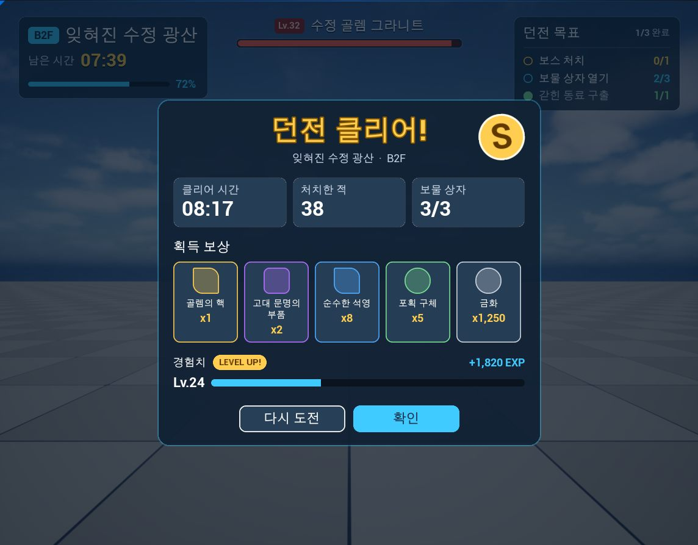
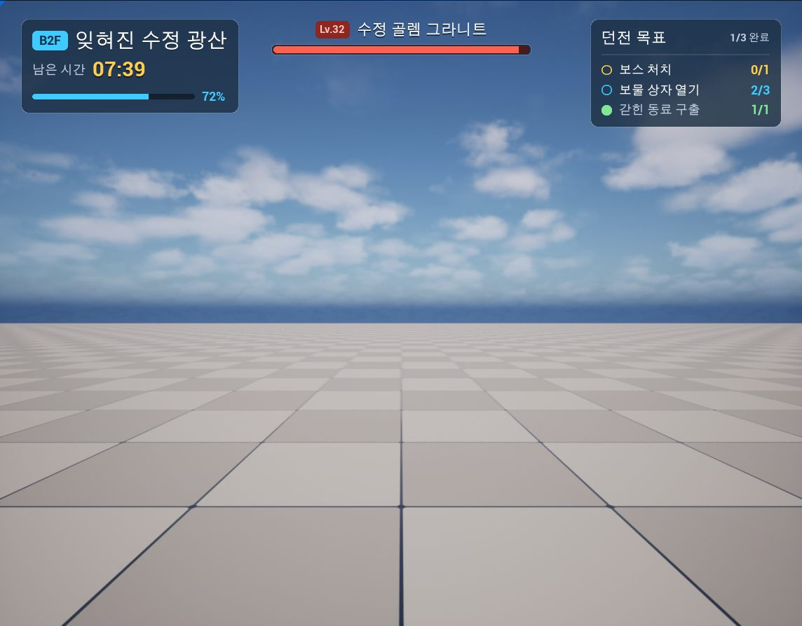

# Agent MCP for Unreal Engine 5.5

[한국어](README.ko.md)

Agent MCP runs a [Model Context Protocol](https://modelcontextprotocol.io) server inside Unreal Engine 5.5, allowing coding agents such as Claude Code and Codex to **inspect a project, modify it, run it, and verify the result**.

Rather than being only a remote-control layer for Unreal, the plugin focuses on **agent workflows for real game-development tasks**. Its design takes inspiration from the experimental MCP/toolset and Agent Skill concepts in Unreal Engine 5.8, but is reimplemented for UE 5.5. Skills are served as Markdown `SKILL.md` files compatible with Claude Code and Codex.

## Core features

### Agent Skills

The plugin serves task guidance to connected agents. A skill consists of `SKILL.md` plus optional references and scripts, and project-specific skills can override the defaults that ship with the plugin.

Included skills:

- `umg-authoring`: production-oriented UMG authoring with reusable Widget Blueprint components, C++ `BindWidget` contracts, data-driven lists, Theme Data Assets and capture-based review
- `ui-style-system`: design tokens, a UI kit/gallery, style extraction and viewport-capture comparison
- `ui-art-requests`: an art request → review → import → connection workflow between UMG and an image model, another agent or an artist
- `blueprint-graphs`: Blueprint classes and logic: create a class, add variables, functions and event dispatchers, look node types up, add and wire nodes, compile once and check the behavior in a play session

### UMG-focused tools

The UMG toolset goes beyond creating Widget Blueprints.

- inspect Widget Trees and Named Slots
- inspect C++ parent classes and verify `BindWidget` / `BindWidgetOptional` contracts against the actual widget names and types
- create Widget Blueprints, add whole subtrees, and change widget and slot properties
- dry-run destructive edits and report the affected bindings and graph references before removal
- iterate through Blueprint compile → PIE → viewport capture → review

### Blueprint logic tools

Agents can build Blueprint logic without the graph editor. Node types are named as in the experimental Blueprint toolset of UE 5.8 (`Development|PrintString`), reimplemented on UE 5.5 editor APIs.

- create Blueprint classes and add variables, functions with inputs and outputs, and event dispatchers
- find node types as the editor's node menu offers them, optionally only those that connect to a given pin
- add, wire and remove nodes and set pin values in one call that is checked first, recorded as one undo step and rolled back when an operation fails
- read a large graph one event chain at a time, with each node's compile message
- verify through Blueprint compile → PIE → log

### Build → Run → Review

Blueprint and C++ compilation, Play In Editor, editor logs and viewport capture are available through the same MCP server so an agent can verify what it changed in the running editor.

```text
Inspect → Edit → Compile → PIE → Capture / Log → Review → Iterate
```

### Reflection-based toolsets

Tools are plain `static UFUNCTION`s. Names, descriptions, arguments and result JSON schemas are generated from Unreal Reflection, so adding a function to a toolset creates an MCP tool.

> **Status: beta.** Built and tested with Unreal Engine 5.5.4 (installed build) on Windows 64-bit. The smoke test in this repository passes 246 checks against the testbed project. Other engine versions and platforms have not been tried.

## Dungeon UI — workflow case study

`Content/Samples/DungeonUi` contains a dungeon progress HUD and result popup built by Claude Code **without opening the UMG Designer**, using Agent MCP tools and skills.

The first version was a flat tree of 48 and 78 widgets per screen. It worked, but repeated elements were copied, style values were scattered inline, and the reward list could not grow from data.

After review, the production rules were moved into the `umg-authoring` skill and the UI was rebuilt around reusable components and data:

```text
Flat Widget Tree
      ↓ review
Reusable Widget Blueprint Components
+ C++ BindWidget Contracts
+ DynamicEntryBox
      ↓ review
Theme Data Asset
+ DataTable
+ Art Request Pipeline
+ Capture-based Review
```





The [Dungeon UI case study](Docs/Samples/DungeonUi.md) records the rejected versions, the problems they revealed, and how those findings changed both the sample and the plugin workflow.

Its look is a small design system: color and radius tokens and named box, text, bar and button styles in a theme data asset, styled widgets that store only a style name, and a kit gallery that shows every token and component. [UI style system](Docs/UiStyleSystem.md) describes how an agent extracts, applies and checks a style with the scripts of the `ui-style-system` skill.

## Documentation

- [Installation](#installation)
- [Connecting a client](#connecting-a-client)
- [Tools](#tools)
- [Skills](#skills)
- [Safety](#safety)
- [Settings](#settings)
- [Writing tools](#writing-tools)
- [Testbed and smoke test](#testbed-and-smoke-test)
- [Limitations](#limitations)
- [Background](#background)
- [License](#license)

## Installation

1. Copy `Plugins/AgentMcp` into the `Plugins` folder of your project.
2. Enable the plugin in **Edit > Plugins**, or in the `.uproject` file:
   ```json
   "Plugins": [ { "Name": "AgentMcp", "Enabled": true } ]
   ```
3. Build the editor target of your project (the plugin ships as source code) and open the editor.

When the editor has loaded, the output log shows:

```
LogAgentMcpProtocol: Agent MCP server listening on http://127.0.0.1:18765/mcp (39 tools).
```

The editor then writes `.mcp.json` and `.codex/config.toml` into the project folder with that endpoint, so Claude Code finds the
editor with no further setup. Codex reads a project file only in a folder it trusts; to reach every folder instead, turn on
**Write User Codex Config** in Project Settings or call `editor_write_client_config` with `bUserCodexConfig`, which points the entry of the user's
`~/.codex/config.toml` at this editor and keeps a copy of the file before its first change. While `AuthToken` is set the editor
leaves the project files alone, because they are often committed and would carry the token; add the header by hand as below.

## Connecting a client

The server speaks MCP Streamable HTTP with JSON responses at `http://127.0.0.1:18765/mcp`.

The editor writes both files on startup, so this section is what they contain and how to write them by hand.

For Claude Code, add a `.mcp.json` file to the project root:

```json
{
  "mcpServers": {
    "unreal": { "type": "http", "url": "http://127.0.0.1:18765/mcp" }
  }
}
```

If `AuthToken` is set, add `"headers": { "Authorization": "Bearer <token>" }` to the server entry.

For Codex, add a `.codex/config.toml` file to the project root. Codex reads it only in a trusted project, one that `~/.codex/config.toml` lists with `trust_level = "trusted"` after you trust the folder.

```toml
[mcp_servers.unreal]
url = "http://127.0.0.1:18765/mcp"
tool_timeout_sec = 600
```

`tool_timeout_sec` raises the Codex default of 60 seconds, which compiling, saving and play sessions can exceed. If `AuthToken` is set, add `http_headers = { Authorization = "Bearer <token>" }`, or name an environment variable that holds the token with `bearer_token_env_var`. Start a new Codex session after changing the file.

The server returns short usage instructions from `initialize`, including the list of skills. Agents should start with `editor_get_state`.

**One port per editor.** Every editor that enables the plugin uses the configured port. When two editors run at the same time, the second one cannot bind the port, logs `Agent MCP server failed to start`, and serves no tools. Give projects that run at the same time different ports, and check the `project` field of `editor_get_state` before changing anything.

## Tools

**Read** tools have no side effects. **Write** tools run in an undoable editor transaction and are refused during Play In Editor. **Destructive** tools are Write tools that only report what they would do unless `bConfirm` is true. **Control** tools change editor state that cannot be undone: play sessions, compiling, saving, and creating or importing assets.

| Tool | Access | Description |
|---|---|---|
| `editor_get_state` | Read | Open level, play session, unsaved packages, selection, undo history and server state |
| `editor_undo`, `editor_redo` | Control | Undo or redo the last editor transaction |
| `editor_write_client_config` | Control | Write the client configuration that points an agent at this editor, optionally including the user's Codex configuration |
| `log_get_recent` | Read | Editor log lines after a sequence number, filtered by verbosity, category or text |
| `actor_find` | Read | Actors by label or name, class, tag, folder or selection, in the editor or play world |
| `actor_inspect` | Read | Class, Blueprint, tags, transform, attachment and components of an actor |
| `actor_set_transform` | Write | Move, rotate or scale an actor |
| `actor_spawn` | Write | Place actors from mesh or Blueprint assets, or from native classes, with label, transform, folder and properties |
| `actor_duplicate` | Write | Copy an actor in a row with a fixed offset, or onto given transforms |
| `actor_attach` | Write | Attach one actor to another, optionally on a socket |
| `actor_set_folder` | Write | Move actors to a World Outliner folder |
| `actor_delete` | Destructive | Delete actors together with the actors attached to them |
| `level_new` | Control | Create a level, empty or from a template, save it and open it |
| `level_open` | Control | Open a level in the editor |
| `level_save` | Control | Save the level open in the editor, or every level with unsaved changes |
| `object_list_properties` | Read | Properties of an object and whether they can be changed |
| `object_get_properties` | Read | Property values as JSON |
| `object_set_properties` | Write | Change properties of an actor or component in the editor level, of a project asset such as a data asset or texture, or the class defaults of a project Blueprint, with readback |
| `pie_start`, `pie_stop` | Control | Start or stop Play In Editor and wait until the session has begun or shut down. `pie_start` plays in the level viewport, or with `windowWidth` and `windowHeight` in a new window whose viewport has that size |
| `pie_status` | Read | Whether a play session is starting or running |
| `asset_find` | Read | Assets by folder, class and name, without loading them |
| `asset_inspect` | Read | Class, tags, file size, loaded and dirty state and reference counts of an asset |
| `asset_referencers`, `asset_dependencies` | Read | Packages that reference an asset, or that it depends on |
| `asset_save` | Control | Save loaded project assets without dialogs |
| `asset_create` | Control | Create a data asset, a DataTable, a string table or a Blueprint class with a parent class |
| `asset_import_textures` | Control | Import PNG, JPEG, TGA or BMP files as textures, with the settings for UMG. `bMipmaps` keeps mipmaps for images drawn smaller than their size or at several sizes |
| `asset_import_meshes` | Control | Import FBX, glTF, GLB or OBJ files as static meshes, with their size and collision |
| `class_find_derived` | Read | C++ and Blueprint classes that derive from a class, with headers and assets |
| `datatable_get_schema` | Read | Row struct, C++ header, columns, C++ types and JSON schemas |
| `datatable_list_rows`, `datatable_get_rows` | Read | Row names, and values keyed by row and column |
| `datatable_set_rows`, `datatable_add_rows`, `datatable_rename_rows` | Write | Change, add or rename rows of a project DataTable |
| `datatable_remove_rows` | Destructive | Remove rows of a project DataTable |
| `stringtable_get_entries` | Read | Namespace, keys and source strings of a string table |
| `stringtable_set_entries` | Write | Add entries to a project string table or change their strings, and set its namespace |
| `blueprint_inspect` | Read | Parent chain, interfaces, components, variables, functions and graphs |
| `blueprint_compile` | Control | Compile a Blueprint or Widget Blueprint and return its errors and warnings |
| `blueprint_get_graph` | Read | Nodes of a graph with their pins, values and links, optionally only the entry points or the chain linked to one node |
| `blueprint_find_node_types` | Read | Node types a graph can take, as in the editor's node menu, by type id such as `Development\|PrintString`, optionally only those that connect to a pin |
| `blueprint_edit_graph` | Write | Add, remove and move nodes, connect and break pins, set input values and add pins, in order, as one undo step |
| `blueprint_add_members` | Write | Add variables, functions with inputs and outputs, and event dispatchers to a Blueprint, as one undo step |
| `anim_build_blend_space` | Control | Create or rebuild a 1D blend space from animations placed on one axis, with optional smoothing of the axis |
| `anim_build_montage` | Control | Create or rebuild a montage whose segments start named sections, with loops and jumps between sections |
| `anim_build_anim_blueprint` | Control | Create an Animation Blueprint, or rebuild its anim graph, from a tree of inertialization, slot, blend space and sequence nodes, and compile it |
| `umg_inspect` | Read | Widget tree with slots, BindWidget properties, animations and property bindings |
| `umg_create_widget_blueprint` | Control | Create a Widget Blueprint with a parent class and a root panel |
| `umg_add_widgets` | Write | Add widgets, whole subtrees or Widget Blueprint instances, with widget and slot properties, in one call |
| `umg_set_widget_properties` | Write | Change widget properties, slot values and the variable flag of several widgets |
| `umg_remove_widgets` | Destructive | Remove widgets with their descendants, property bindings and graph references |
| `viewport_capture` | Read | PNG of the level viewport or the play session, including the game UI |
| `viewport_set_camera` | Control | Point the level viewport camera at a place or frame an actor, so the next capture shows it |
| `livecoding_compile` | Control | Compile changed C++ with Live Coding and wait for the result |
| `skills_list` | Read | Skills of the plugin and the project with their descriptions, and skill files that were skipped |
| `skills_get` | Read | Instructions of a skill, or one of its other files |

A typical verification loop: `blueprint_compile` → `pie_start` → `log_get_recent` from the returned `startLogSequence` → `viewport_capture` → `pie_stop`.

To build a user interface: `umg_create_widget_blueprint` (with a C++ parent class that declares `BindWidget` properties) → `umg_add_widgets` → `blueprint_compile` → inspect it in a play session with `viewport_capture` → adjust it with `umg_set_widget_properties`. Values are JSON: property names are the C++ names (`Text`, `Font`, `Padding`, `LayoutData`), struct values may list only the fields to set, and enum values are names (`HAlign_Center`, `RoundedBox`). Widget Blueprint classes can be nested as component instances and their instance properties can be set the same way.

To keep presentation in data, `asset_create` can make a theme data asset or item DataTable, `object_set_properties` and the datatable tools fill them, and `asset_import_textures` brings in icons and frames with UMG texture settings. Visible text goes into a string table (`asset_create` with `StringTable`, then `stringtable_set_entries`), and a text property references an entry when it is set to `LOCTABLE("/Game/Text/ST_Ui.ST_Ui", "Key")`, so the text keeps one key for localization however often a script writes it.

To block out a level: `level_new` → `actor_spawn` with meshes or Blueprints → `actor_duplicate` for rows and grids → `actor_attach` and `actor_set_folder` to keep the outliner readable → `viewport_set_camera` and `viewport_capture` to look at it → `level_save`. `actor_set_transform` and `object_set_properties` adjust what is already placed, and `editor_undo` reverts the last call.

To change Blueprint logic: `asset_create` with `assetClass` `Blueprint` for a new class → `blueprint_add_members` for its variables and functions → `blueprint_get_graph` to read a graph → `blueprint_find_node_types` for each node type → `blueprint_edit_graph` to add nodes and wire them by the pin names it returns → `blueprint_compile` → `pie_start` and `log_get_recent` to see it run → `asset_save`.

To animate a character: `anim_build_blend_space` for locomotion → `anim_build_montage` for each attack, with a looping section where the game decides when to go on → `anim_build_anim_blueprint` with a Slot node over the blend space that reads the speed from a variable of the C++ parent class → `asset_save`.

## Skills

A skill is a task guide for agents: a folder with a `SKILL.md` file whose front matter contains a `name` and a `description`, matching the format used by Claude Code and Codex. The editor serves the skills, so every connected agent reads the same version and the guidance travels with the plugin.

- `initialize` lists skills and descriptions in the server instructions.
- `skills_list` returns discovered skills and reports invalid skill files.
- `skills_get` returns the guide and can also serve text files such as references, examples and scripts from inside the skill folder.

Skills are read from these folders in this order. A skill from a later folder replaces one with the same name from an earlier folder, allowing projects to adapt plugin guidance.

1. `Plugins/AgentMcp/Skills`: plugin skills, currently `umg-authoring`, `ui-art-requests`, `ui-style-system` and `blueprint-graphs`
2. `AgentMcp/Skills` in the project folder
3. folders configured through `SkillDirectories`

Skill files are read on every call, so edits apply without restarting the editor. Only the short list included in server instructions is created when the server starts.

Claude Code and Codex choose skills by their descriptions. To let them automatically begin a served skill, put a short `SKILL.md` with the same name and description under `.claude/skills/<name>/` or `.agents/skills/<name>/` that tells the agent to call `skills_get`. This repository includes those bridges for all plugin skills.

Unreal Engine 5.8 also provides an Agent Skill concept. UE 5.8 uses `UAgentSkill` classes authored in C++, Python or Blueprint; Agent MCP instead implements Markdown skills so they are editable as text and share the same format as Claude Code and Codex skills.

## Safety

- **Local only.** The server listens on `127.0.0.1`. Requests whose browser `Origin` is not `localhost`, `127.0.0.1` or `[::1]` are refused. `AuthToken` additionally requires a bearer token.
- **Undoable, all-or-nothing writes.** Write tools validate values before changing anything and run in an editor transaction. If a tool fails after changing state, the transaction is rolled back.
- **No writes during play.** Write tools and asset creation/import tools are refused while Play In Editor is starting or running.
- **Project content only.** Assets can be created, imported, changed and saved only under `/Game` and project plugins. Engine content is read-only.
- **Explicit saving.** No tool saves as a side effect, with one exception: `level_new` writes the level it creates, because a level only exists on disk. `asset_save` saves loaded project assets only and still refuses levels; levels are saved with `level_save`, which writes the level open in the editor.
- **No level is replaced silently.** `level_new` and `level_open` refuse to run while a level has unsaved changes, because opening a level discards them.
- **Dry runs.** Destructive tools need `bConfirm: true` to act, and `asset_import_textures` validates every entry before importing anything.
- **Allow and block lists.** `AllowedTools` and `BlockedTools` hide tools, while `BlockedProperties` protects properties from `object_set_properties` and UMG tools.
- **Files.** `skills_get` can read only inside a skill folder and refuses outside paths and hidden files.
- There is no tool that runs console commands or arbitrary scripts.

## Settings

Set values in `Config/DefaultEditorPerProjectUserSettings.ini` of the project:

```ini
[/Script/AgentMcpToolset.AgentMcpSettings]
Port=18765
+BlockedTools=datatable_remove_rows
```

| Key | Default | Meaning |
|---|---|---|
| `bAutoStartServer` | `True` | Start the server when the editor has loaded |
| `Port` | `18765` | Loopback port |
| `UrlPath` | `/mcp` | Endpoint path |
| `AuthToken` | empty | When set, clients must send `Authorization: Bearer <token>` |
| `ExposureMode` | `Native` | `Native` registers every tool. `ToolSearch` registers only `toolsets_list`, `toolsets_describe` and `tools_call` |
| `BlockedTools`, `AllowedTools` | empty | Tool-name wildcards such as `datatable_*` |
| `bAllowWritesDuringPIE` | `False` | Allow Write tools during Play In Editor |
| `BlockedProperties` | empty | `ClassName.PropertyName` wildcards refused by `object_set_properties` and UMG tools |
| `BusyWaitTimeoutSeconds` | `10` | How long a call waits while the editor saves, collects garbage or loads assets |
| `MaxResultBytes` | `65536` | Result text above this size is truncated |
| `LogBufferLines` | `20000` | Log lines kept for `log_get_recent` |
| `SkillDirectories` | empty | Additional skill folders searched after the plugin and project folders |

## Writing tools

Add `AgentMcpToolset` to the dependencies of an editor module, then declare static functions on a `UAgentMcpToolset` subclass:

```cpp
#include "AgentMcpToolset.h"

#include "MyTools.generated.h"

USTRUCT(BlueprintType)
struct FMyGreeting
{
    GENERATED_BODY()

    UPROPERTY()
    FString Message;
};

UCLASS(meta = (McpToolset = "my"))
class UMyTools : public UAgentMcpToolset
{
    GENERATED_BODY()

public:
    UFUNCTION(BlueprintCallable, Category = "My Tools", meta = (AICallable, McpAccess = "Read", BlueprintInternalUseOnly = "true"))
    static FMyGreeting Greet(const FString& Name = TEXT("world"));
};
```

This becomes the tool `my_greet` with an optional string argument `name`.

- Toolset classes are found automatically. Tool names are `<McpToolset>_<function name in snake_case>`, and comments provide descriptions.
- `McpAccess` is `Read`, `Write`, `Destructive` or `Control`; a missing value is treated as `Write`.
- Keep `BlueprintCallable`: Unreal Engine 5.5 records C++ default argument values only for Blueprint-callable functions.
- Return a `USTRUCT(BlueprintType)`; its fields become the JSON result.
- Report failures with `UE::AgentMcp::RaiseToolError(TEXT("CODE"), TEXT("Message"), TEXT("Hint"))`.
- Object arguments (`UObject*`, `AActor*`, `UClass*`) accept object paths, and actors also accept labels.
- For work that finishes on a later frame, return `UAgentMcpAsyncResult::Create(TimeoutSeconds, PollFunction)`; only Read and Control tools can do this.
- To return an image, add an `FAgentMcpImage` field to the result struct.

## Testbed and smoke test

The repository root is a small Unreal Engine 5.5 project that builds and tests the plugin.

| Path | Contents |
|---|---|
| `Plugins/AgentMcp` | The plugin, with its skills in `Plugins/AgentMcp/Skills` |
| `Source/AgentMcpTestbed` | Row structs, data assets, widget bases, game mode and the C++ classes of the UI sample |
| `Source/AgentMcpTestbedEditor` | Test-only tools and `sample_show_widget` |
| `Content/Samples/DungeonUi` | Widget Blueprints, theme data asset and item table built through the tools |
| `Art/Requests` | Art requests for the sample |
| `Docs` | Case studies, the UI style system of the sample, and experiments |
| `.mcp.json`, `.codex/config.toml` | Claude Code and Codex connection settings for testbed port 18766 |
| `.claude/skills`, `.agents/skills` | Bridges that let clients begin the served plugin skills |
| `Config` | Testbed port **18766**, the smoke test's skill folder in `SkillDirectories`, and the UI sample's theme in `DefaultGame.ini` |
| `Tools/mcp_smoke.py` | Smoke test using Python 3 standard library only |
| `Tools/mcp_call.py` | Calls one tool from the command line |

1. Build the `AgentMcpTestbedEditor` target.  
   `<UE>\Engine\Build\BatchFiles\Build.bat AgentMcpTestbedEditor Win64 Development -Project=<path>\AgentMcpTestbed.uproject -WaitMutex`
2. Open `AgentMcpTestbed.uproject` and wait for `Agent MCP server listening on http://127.0.0.1:18766/mcp`.
3. Run `python Tools/mcp_smoke.py --out Saved/MCP/smoke.json`.

The smoke test covers MCP transport and errors, every tool, undo and rollback, request cancellation, Play In Editor, viewport capture with game UI, Live Coding, nested Widget Blueprint editing, Blueprint graph editing, skills, data-asset/DataTable creation, texture and mesh import, level authoring and animation assets.

To call a single tool:

```bash
python Tools/mcp_call.py editor_get_state --url http://127.0.0.1:18766/mcp --expect-project AgentMcpTestbed
```

## Limitations

- Tested with Unreal Engine 5.5.4 on Windows 64-bit only.
- Major inspection, UMG, compilation, PIE, save, skill, DataTable and asset tools were used from Claude Code 2.1.270 while building the UI sample.
- The Codex setup follows Codex documentation but has not yet been tested with Codex.
- Responses are plain JSON. There is no SSE or progress streaming.
- Requests execute on the editor game thread. **Use Less CPU when in Background** can make calls noticeably slower when the editor is unfocused.
- `livecoding_compile` blocks until compilation completes, and Live Coding cannot apply reflected declaration changes to `UCLASS`, `USTRUCT`, `UPROPERTY` or `UFUNCTION`.
- Meshes are imported with the materials and textures their file carries, and there is no tool to author materials. Fab content is added through the Fab plugin, which needs the user's Epic account.
- The level tools create and open levels and place actors. World Partition data layers, streaming sources and level instances are not covered, and a partitioned level saves its actors in their own packages.
- Source control handling of `level_save` has not been tested.
- Blueprint variables, functions and event dispatchers can be added but not yet removed or renamed; local variables, function overrides and interfaces are not covered, and graphs are not laid out automatically. In a localized editor the node type ids of variables and event dispatchers carry localized categories. Widget animations and designer property bindings can be inspected but not edited, and widgets cannot yet be moved to a different parent or changed to another class; the UI sample rebuilt subtrees instead.
- `ToolSearch` exposure mode and source-control handling on save have not yet been tested.

## Background

The toolset layout and reflection-based design take inspiration from the experimental Model Context Protocol/toolset plugins shipped by Epic Games with Unreal Engine 5.8 and were reimplemented for Unreal Engine 5.5. The Agent Skill concept was also an influence, but this project does not port `UAgentSkill`; it implements a separate Markdown `SKILL.md` system that can be shared with Claude Code and Codex.

This repository contains no source files from Epic's plugins. Unreal and Unreal Engine are trademarks or registered trademarks of Epic Games, Inc.

## License

[MIT License](LICENSE).
